%%{init: {'theme': 'default', 'themeVariables': { 'fontSize': '18px', 'primaryColor': '#0d6efd', 'primaryTextColor': '#fff', 'primaryBorderColor': '#0d6efd', 'lineColor': '#555', 'secondaryColor': '#6c757d', 'tertiaryColor': '#f8f9fa' }}}%%

```mermaid
graph TD
    %% Main Cloud Skills Roadmap
    Cloud[Cloud Foundation Roadmap] --> Linux[1. Linux Basics]
    Cloud --> AWS[2. AWS Cloud Fundamentals]
    Cloud --> Git[3. Source Control with Git/GitHub]
    Cloud --> Terraform[4. Infrastructure as Code with Terraform]
    Cloud --> Docker[5. Containers with Docker]
    Cloud --> CICD[6. CI/CD with GitHub Actions]
    Cloud --> Ansible[7. Configuration Management with Ansible]
    
    %% Add more spacing between nodes
    linkStyle default stroke-width:2px
    
    %% Linux Basics
    Linux --> L1[1.1 Terminal Basics]
    Linux --> L2[1.2 File System Navigation]
    Linux --> L3[1.3 Process Management]
    Linux --> L4[1.4 Package Management]
    Linux --> L5[1.5 Bash Scripting]
    
    %% AWS Cloud Fundamentals
    AWS --> A1[IAM]
    AWS --> A2[Compute Services]
    AWS --> A3[VPC]
    AWS --> A4[S3]
    
    %% Git/GitHub
    Git --> G1[Basic Git Commands]
    Git --> G2[Repository Management]
    Git --> G3[Branching Workflows]
    
    %% Terraform
    Terraform --> T1[Terraform Basics]
    Terraform --> T2[Server Creation]
    Terraform --> T3[Scaling]
    Terraform --> T4[Advanced Resources]
    Terraform --> T5[Modules]
    
    %% Docker
    Docker --> D1[Docker Architecture]
    Docker --> D2[Docker CLI]
    Docker --> D3[Dockerfile Basics]
    Docker --> D4[Docker Compose]
    Docker --> D5[Docker in CI/CD]
    
    %% CI/CD with GitHub Actions
    CICD --> C1[Basic Workflows]
    CICD --> C2[Advanced Workflows]
    CICD --> C3[Custom Runners]
    
    %% Ansible
    Ansible --> AN1[Ansible Basics]
    Ansible --> AN2[Creating/Running Playbooks]
    Ansible --> AN3[Advanced Playbooks]
    Ansible --> AN4[Dynamic Inventory]
    
    %% Style definitions
    classDef default fill:#f9f9f9,stroke:#333,stroke-width:1px
    classDef main fill:#d1e7dd,stroke:#0d6efd,stroke-width:2px,color:#0d6efd
    classDef section fill:#e2e3e5,stroke:#6c757d,stroke-width:2px
    
    %% Apply styles
    class Cloud main
    class Linux,AWS,Git,Terraform,Docker,CICD,Ansible section
```

