# Cloud Roadmap

This roadmap outlines the fundamental skills and technologies to build a strong foundation in cloud engineering, focusing on Linux, AWS, and essential DevOps practices.

## 1. Linux Basics

### 1.1 Linux Terminal Basics

- Basic CLI commands:
  - `ls` - list directory contents
  - `cd` - change directory
  - `pwd` - print working directory
  - `mkdir` - create directory
  - `rmdir` - remove directory
- Command syntax and options:
  - `command -options arguments`
  - Example: `ls -l /home`
- Getting help:
  - `man command` - manual pages
  - `command --help` - quick help
  - `apropos keyword` - search man pages

### 1.2 File System Navigation

- Linux directory structure:
  - `/` - root
  - `/home` - user directories
  - `/etc` - configuration files
  - `/var` - variable data
- File operations:
  - `cp file1 file2` - copy
  - `mv file1 file2` - move/rename
  - `rm file` - remove
  - `touch file` - create empty file
- File permissions and ownership:
  - `chmod 755 file` - change permissions
  - `chown user:group file` - change owner
  - `ls -l` - view permissions
- Disk usage:
  - `df -h` - disk space
  - `du -sh dir` - directory size

### 1.3 Process Management

- Viewing processes:
  - `ps aux` - all processes
  - `top` - interactive process viewer
  - `htop` - enhanced process viewer
- Managing processes:
  - `kill PID` - terminate process
  - `killall name` - terminate by name
  - `pkill pattern` - terminate by pattern
- Background/foreground:
  - `command &` - run in background
  - `fg %1` - bring to foreground
  - `jobs` - list background jobs

### 1.4 Package Management

- apt (Debian/Ubuntu):
  - `sudo apt update` - update package lists
  - `sudo apt install package` - install
  - `sudo apt remove package` - remove
  - `sudo apt upgrade` - upgrade packages
- yum (RHEL/CentOS):
  - `sudo yum install package` - install
  - `sudo yum remove package` - remove
  - `sudo yum update` - update packages

### 1.5 Bash Scripting

- Basic shell scripting:
  - `#!/bin/bash` - shebang
  - `chmod +x script.sh` - make executable
  - `./script.sh` - run script
- Variables:
  - `var="value"` - assignment
  - `echo $var` - access
  - `read var` - user input
- Control structures:
  - if/else/fi
  - for/while loops
  - case statements
- Example script:

  ```bash
  #!/bin/bash
  echo "Hello $USER!"
  for i in {1..5}; do
    echo "Count: $i"
  done
  ```

## 2. AWS Cloud Fundamentals

- Identity and Access Management (IAM):

- Compute Services:
  - EC2 (Elastic Compute Cloud):

  - Lambda:

- Virtual Private Cloud (VPC):

- Simple Storage Service (S3):

## 3. Source Control with Git/GitHub

- Basic Git commands:
  - `git clone repo_url` - clone a repository
  - `git status` - show working tree status
  - `git add file` - stage changes
  - `git commit -m "message"` - commit changes
  - `git push` - push to remote repository
  - `git pull` - fetch and merge changes
- Repository management:
  - Creating repositories (GitHub UI)
  - Managing access (collaborators, teams)
  - Branch protection rules (GitHub settings)
- Branching workflows:
  - `git branch branch_name` - create branch
  - `git checkout branch_name` - switch branch
  - `git merge branch_name` - merge branches
  - Pull Requests (GitHub workflow)
  - Code review process

## 4. Infrastructure as Code with Terraform

- Terraform basics:
  - `terraform init` - initialize working directory
  - `terraform plan` - create execution plan
  - `terraform apply` - apply changes
  - `terraform state` - state management commands
- Creating a server:
  - Basic EC2 instance configuration
  - Applying infrastructure changes
- Scaling with variables/outputs/count:
  - Using variables for configuration
  - Outputting resource attributes
  - Creating multiple instances with count
- Advanced resources:
  - Auto Scaling Groups (ASG)
  - VPC and subnet configuration
  - Security groups and networking
- Modules:
  - Creating reusable modules
  - Module composition
  - Versioning and publishing modules

## 5. Containers with Docker

- Docker architecture basics:
  - Containers vs virtual machines
  - Images and layers
  - Registries (Docker Hub, ECR)
- Docker CLI essentials:
  - `docker ps` - list containers
  - `docker run` - start container
  - `docker exec` - execute command in container
  - `docker stop` - stop container
  - `docker rm` - remove container
  - `docker image` - manage images
  - `docker push/pull` - share images
  - `docker logs` - view container logs
- Dockerfile basics:
  - Creating custom images
  - Understanding layers and caching
  - Optimizing build performance
- Docker Compose:
  - Declarative container configuration
  - Multi-container applications
  - Networking and volumes
- Docker in CI/CD:
  - Building and testing with Docker
  - Pushing images to registries
  - Deployment strategies

## 6. CI/CD with GitHub Actions

- Basic workflows:
  - Creating `.github/workflows/linter.yml`
  - Example linting workflow:

    ```yaml
    name: Lint Code
    on: [push]
    jobs:
      lint:
        runs-on: ubuntu-latest
        steps:
          - uses: actions/checkout@v3
          - run: npm install
          - run: npm run lint
    ```

- Advanced workflows:
  - Using environment variables and secrets
  - Matrix builds for multiple OS/versions
  - Caching dependencies for faster builds
  - Example with secrets:

    ```yaml
    env:
      NODE_ENV: production
    steps:
      - name: Deploy to AWS
        env:
          AWS_ACCESS_KEY_ID: ${{ secrets.AWS_ACCESS_KEY_ID }}
          AWS_SECRET_ACCESS_KEY: ${{ secrets.AWS_SECRET_ACCESS_KEY }}
    ```

- Custom runners:
  - Setting up self-hosted runners
  - Configuring runner groups
  - Security considerations
  - Example runner workflow:

    ```yaml
    jobs:
      build:
        runs-on: self-hosted
        steps:
          - uses: actions/checkout@v3
    ```

## 7. Configuration Management with Ansible

- Ansible Basics:
  - Ad-hoc commands:
    - `ansible all -m ping` - test connectivity
    - `ansible all -a "uptime"` - run command
    - `ansible all -m setup` - gather facts
  - Inventory files:
    - Static inventory (INI/YAML format)
    - Host variables and groups
  - Playbook structure:
    - YAML format
    - Plays, tasks, modules

- Creating/Running Playbooks:
  - Example: Install Docker

    ```yaml
    - hosts: all
      become: true
      tasks:
        - name: Install Docker
          apt:
            name: docker.io
            state: present
    ```

  - Running playbooks:
    - `ansible-playbook playbook.yml`

- Advanced Playbooks:
  - Variables:
    - `vars:` section
    - Variable files
    - Command-line variables
  - Modules:
    - Common modules (apt, yum, copy, template)
    - Custom modules
  - Conditionals and loops:
    - `when:` statements
    - `with_items:` loops

- Dynamic Inventory:
  - AWS EC2 dynamic inventory:
    - `aws_ec2` plugin
    - Filtering by tags, regions
    - Example configuration:

      ```ini
      plugin: aws_ec2
      regions:
        - us-east-1
      filters:
        tag:Environment: production
      ```

  - Running with dynamic inventory:
    - `ansible-playbook -i aws_ec2.yml playbook.yml`

---

## Cloud Foundation Roadmap - Visual Overview

```mermaid
graph TD
    %% Main Cloud Skills Roadmap
    Cloud[Cloud Foundation Roadmap] --> Linux[1. Linux Basics]
    Cloud --> AWS[2. AWS Cloud Fundamentals]
    Cloud --> Git[3. Source Control with Git/GitHub]
    Cloud --> Terraform[4. Infrastructure as Code with Terraform]
    Cloud --> Docker[5. Containers with Docker]
    Cloud --> CICD[6. CI/CD with GitHub Actions]
    Cloud --> Ansible[7. Configuration Management with Ansible]
    
    %% Linux Basics
    Linux --> L1[1.1 Terminal Basics]
    Linux --> L2[1.2 File System Navigation]
    Linux --> L3[1.3 Process Management]
    Linux --> L4[1.4 Package Management]
    Linux --> L5[1.5 Bash Scripting]
    
    %% AWS Cloud Fundamentals
    AWS --> A1[IAM]
    AWS --> A2[Compute Services]
    AWS --> A3[VPC]
    AWS --> A4[S3]
    
    %% Git/GitHub
    Git --> G1[Basic Git Commands]
    Git --> G2[Repository Management]
    Git --> G3[Branching Workflows]
    
    %% Terraform
    Terraform --> T1[Terraform Basics]
    Terraform --> T2[Server Creation]
    Terraform --> T3[Scaling]
    Terraform --> T4[Advanced Resources]
    Terraform --> T5[Modules]
    
    %% Docker
    Docker --> D1[Docker Architecture]
    Docker --> D2[Docker CLI]
    Docker --> D3[Dockerfile Basics]
    Docker --> D4[Docker Compose]
    Docker --> D5[Docker in CI/CD]
    
    %% CI/CD with GitHub Actions
    CICD --> C1[Basic Workflows]
    CICD --> C2[Advanced Workflows]
    CICD --> C3[Custom Runners]
    
    %% Ansible
    Ansible --> AN1[Ansible Basics]
    Ansible --> AN2[Creating/Running Playbooks]
    Ansible --> AN3[Advanced Playbooks]
    Ansible --> AN4[Dynamic Inventory]
    
    %% Style definitions
    classDef default fill:#f9f9f9,stroke:#333,stroke-width:1px
    classDef main fill:#d1e7dd,stroke:#0d6efd,stroke-width:2px,color:#0d6efd
    classDef section fill:#e2e3e5,stroke:#6c757d,stroke-width:2px
    
    %% Apply styles
    class Cloud main
    class Linux,AWS,Git,Terraform,Docker,CICD,Ansible section
```



This roadmap provides a structured path to acquiring essential cloud skills. Continuous learning and hands-on practice are key to mastering these technologies.
